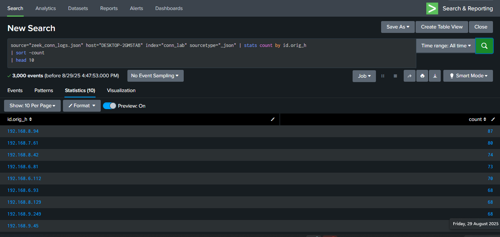
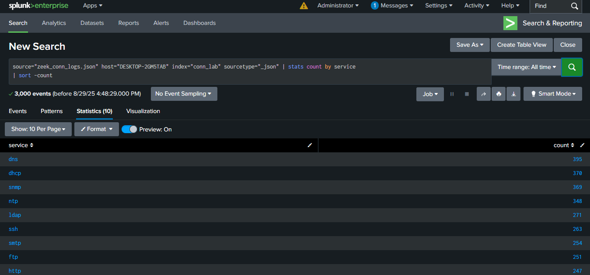
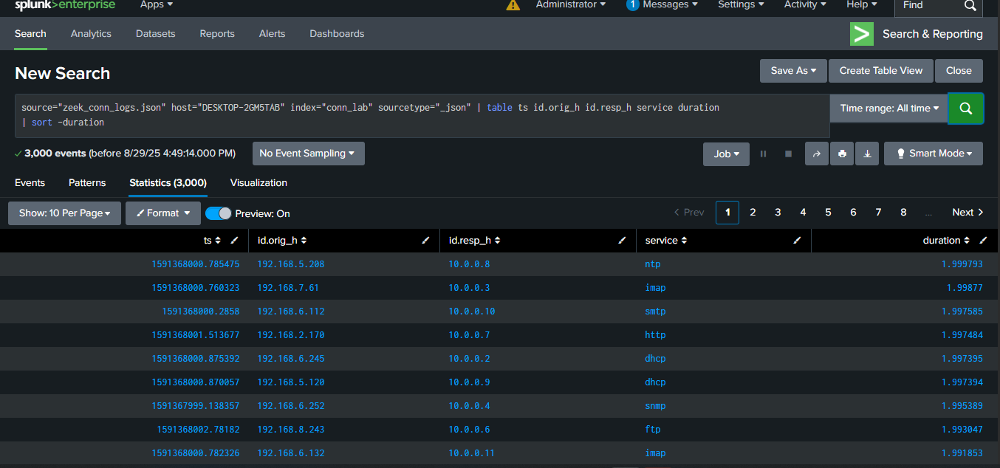
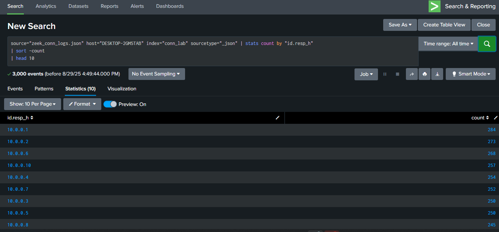

# ZEEK-CONNECTION-LOG-ANALYSIS-PROJECT

## Project Description
This project demonstrates the analysis of Zeek connection logs using Splunk. The objective is to upload and search Zeek-style JSON-formatted connection logs, identify top clients, top servers, most common services, large traffic, and long connections. This is a key skill for SOC analysts to monitor network activity and detect anomalies.

## Lab Setup
- **Tool**: Splunk.
- **Data Source**: Synthetic Zeek-style connection logs in JSON format.
- - **Log File**: `zeek_conn_logs.json` created and uploaded to Splunk.

## Tasks Performed
### Task 1: Top 10 Client IPs (id.orig_h)
- **Query Used**: `index=conn_lab sourcetype="json" | stats count by id.orig_h | sort -count | head 10`
- **Screenshot**: 

### Task 2: List Most Common Services
- **Query Used**: `index=conn_lab sourcetype="json" | stats count by service | sort -count`
- **Screenshot**: 

### Task 3: Find Connections with Duration > 1 Second
- **Query Used**: `index=conn_lab sourcetype="json" duration>1 | table ts id.orig_h id.resp_h service duration | sort -duration`
- **Screenshot**: 

### Task 4: Identify the Most Accessed Internal Servers
- **Query Used**: `index=conn_lab sourcetype="json" | stats count by "id.resp_h" | sort -count | head 10`
- **Screenshot**: 

## How to Use
1. Upload the `zeek_conn_logs.json` file to Splunk with index "conn_lab" and source type "zeek:conn".
2. Navigate to "Search & Reporting" and run the provided SPL queries.
3. Refer to screenshots in the repository root for expected results.

## Files Included
- `zeek_conn_logs.json`: Sample Zeek connection log file in JSON format.
- Screenshots: `Zeek-Connection-Log1.png`, `Zeek-Connection-Log2.png`, `Zeek-Connection-Log3.png`, `Zeek-Connection-Log4.png` (stored in repository root).

## Notes
This project was completed as part of a learning journey to become a SOC analyst. All tasks were performed using Splunk.

.
